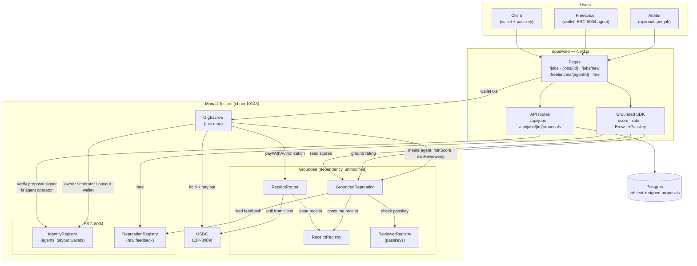
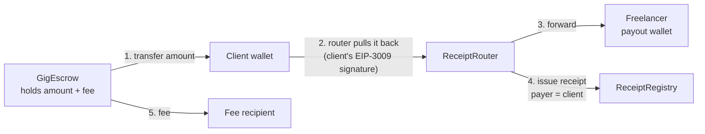
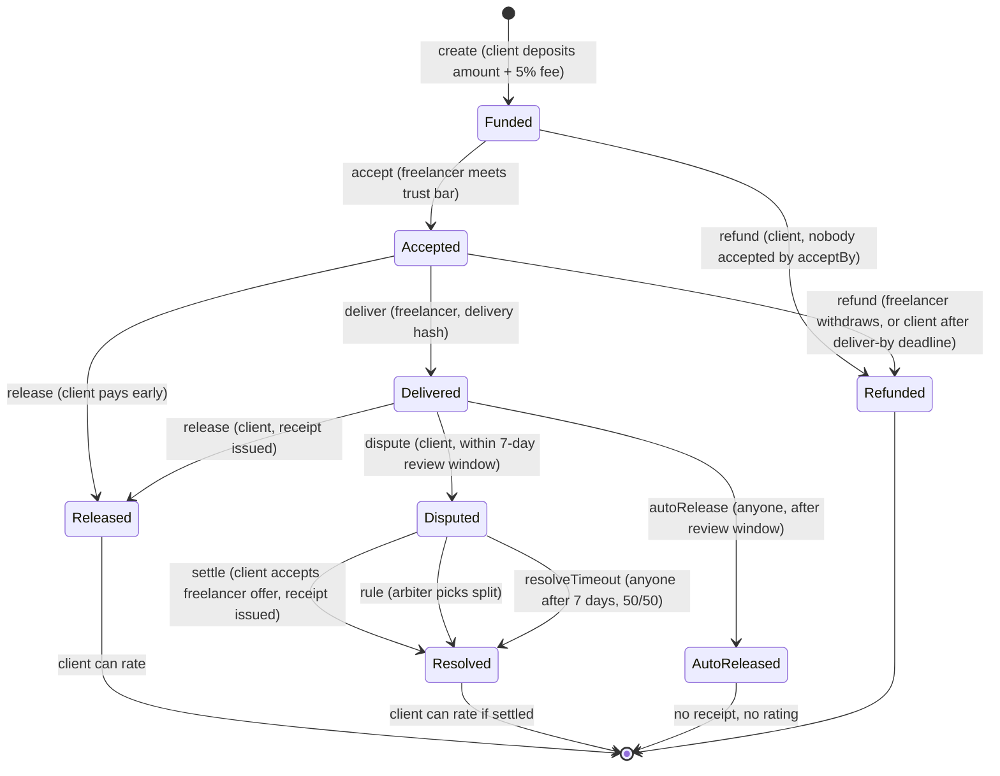
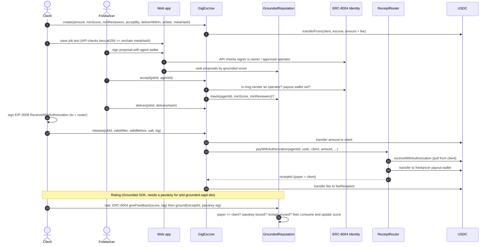
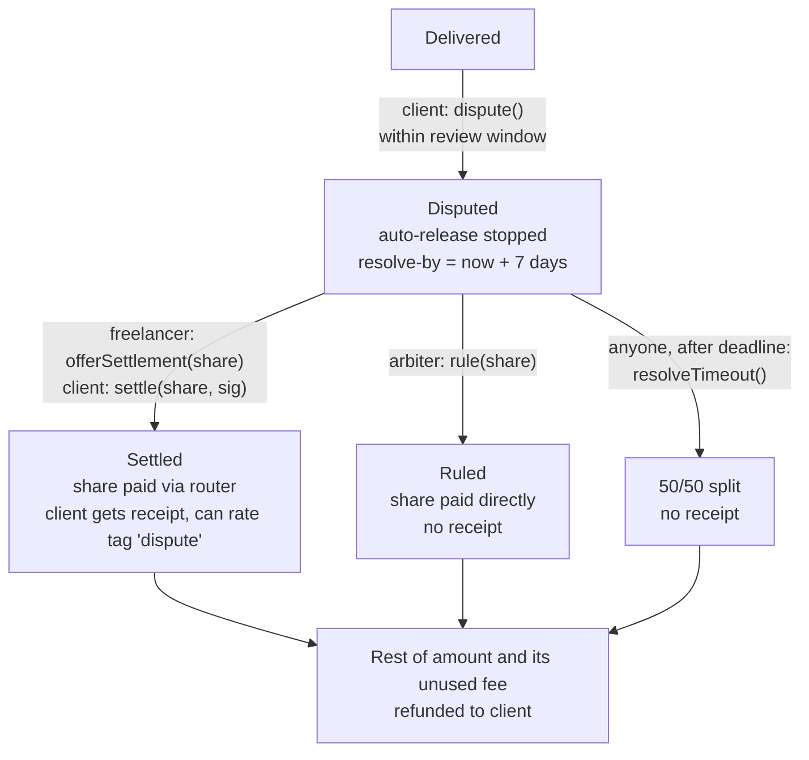
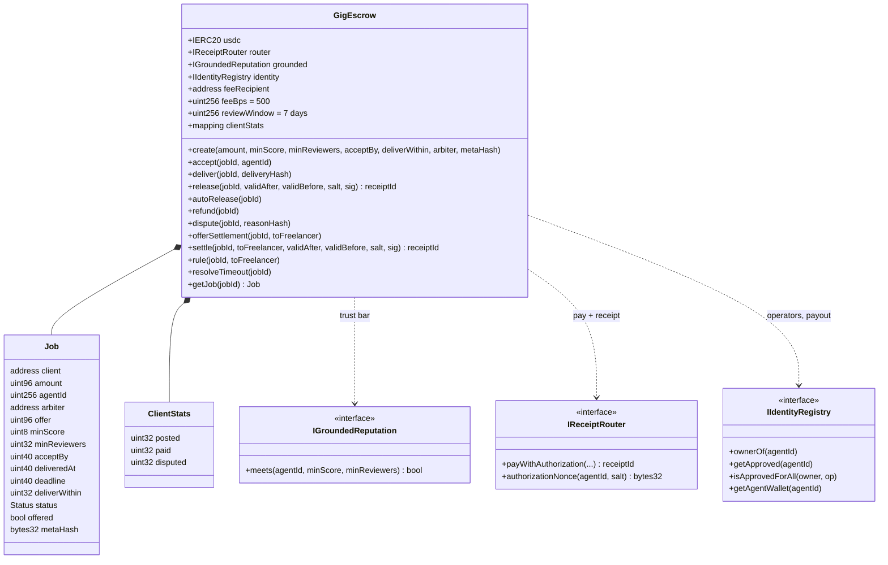

# GigTrust

A freelance marketplace on Monad where a freelancer's reputation can only be moved by clients who actually paid them. The reputation lives onchain in [Grounded](https://grounded.sajal.sbs), so it follows the freelancer off this platform.

> GigTrust uses Grounded, a separately built reputation protocol by the same author, as an onchain dependency. GigTrust's own work is the escrow contract, per-job trust gating, disputes, the marketplace app and the job flows. Grounded contracts were not modified.

**Contents:** [The idea](#the-idea) · [Architecture](#architecture) · [How Grounded is used](#how-grounded-is-used) · [Job lifecycle](#job-lifecycle) · [Payment and rating flow](#payment-and-rating-flow) · [Disputes](#disputes) · [Code structure](#code-structure) · [Trust boundaries](#trust-boundaries) · [Run](#run) · [Status](#status) · [Known limits](#known-limits)

---

## The idea

Marketplace reviews are easy to fake: anyone can leave one, and platforms reward high ratings with visibility. GigTrust fixes this by tying every review to a real payment:

1. The client locks the budget in escrow before any work starts.
2. When the client pays, the money goes through Grounded's `ReceiptRouter`, which issues an onchain **receipt** naming the client as payer.
3. Only the payer of a receipt can rate, once, signed with a passkey. The freelancer's own wallets are excluded.
4. Clients can require a minimum **grounded score** to accept a job, and the escrow contract enforces it.

Everything else (disputes, deadlines, signed proposals, client track record) closes the remaining ways marketplaces fail. The research behind each feature is in [`docs/RESEARCH.md`](docs/RESEARCH.md).

---

## Architecture



**Three layers:**

| Layer | What it holds | Trusted for |
|---|---|---|
| Monad contracts | Money, job state, deadlines, receipts, scores | Everything that matters |
| Next.js app | UI, wallet signing, API routes | Nothing: every read is checked against the chain |
| Postgres | Job title/body, category, proposal pitches | Convenience only; job text is hash-checked against the chain |

---

## How Grounded is used

GigTrust touches Grounded at five points:

| # | Where | Grounded / ERC-8004 call | Why |
|---|---|---|---|
| 1 | `GigEscrow.accept` | `GroundedReputation.meets(agentId, minScore, minReviewers)` | Enforce the client's trust bar onchain; reverts `AgentNotTrusted` |
| 2 | `GigEscrow.release` / `settle` | `ReceiptRouter.payWithAuthorization(...)` | Pay the freelancer **and** issue a receipt with the client as payer |
| 3 | `RateBox` (web) | SDK `rate` → ERC-8004 `giveFeedback` + `GroundedReputation.ground` | Turn the receipt into a counted, passkey-signed rating |
| 4 | Job and profile pages | SDK `score` (grounded score, reviewers, disputes, `ownerChangedAt`) | Rank proposals; flag agents whose owner changed |
| 5 | `accept`, proposals API, payouts | ERC-8004 `IdentityRegistry` (`ownerOf`, `getApproved`, `isApprovedForAll`, `getAgentWallet`) | Who controls the agent, where to pay |

**The payment trick.** Grounded records `from` of the USDC authorization as the receipt's payer. If the escrow paid directly, the escrow would be the payer and nobody could rate. So `release` does this, atomically in one transaction:



If any step fails (bad signature, wrong amount, wrong agent, missing payout wallet), the whole transaction reverts and the money stays in escrow. The client can never keep it. This is proven against the live deployed contracts in `contracts/test/fork/`.

---

## Job lifecycle



Every state has a time-bounded exit, so nobody can lock funds by going silent:

| Who goes silent | What happens |
|---|---|
| Nobody accepts | Client refunds after `acceptBy` |
| Freelancer never delivers | Client refunds after the deliver-by deadline |
| Client never reviews | Anyone auto-releases to the freelancer after 7 days |
| Dispute never resolved | Anyone splits 50/50 after 7 days |

---

## Payment and rating flow

The happy path, end to end:



---

## Disputes



- The fee is charged only on what the freelancer receives.
- The 50/50 timeout means both sides lose something, which gives both a reason to settle first.
- The arbiter is named by the client at creation and shown to freelancers before they accept. It cannot be the client's own address.
- If a freelancer clears their payout wallet to block a ruling, the payout goes to the agent owner instead.

---

## Code structure

```
.
├── contracts/                      Foundry, solc 0.8.28, cancun
│   ├── src/
│   │   ├── GigEscrow.sol           the escrow: jobs, trust bar, release, disputes, clientStats
│   │   └── interfaces/             vendored from Grounded / ERC-8004 (source headers kept)
│   │       ├── IGroundedReputation.sol
│   │       ├── IIdentityRegistry.sol
│   │       └── IReceiptRouter.sol
│   ├── test/
│   │   ├── unit/GigEscrow.t.sol           45 tests incl. fuzz
│   │   ├── invariant/EscrowInvariant.t.sol  balance == Σ open jobs, every path
│   │   ├── fork/GigEscrowFork.t.sol       6 tests vs live Grounded on Monad Testnet
│   │   └── mocks/Mocks.sol                USDC (EIP-3009), router, identity, grounded
│   └── script/Deploy.s.sol         keystore deploy, writes deployments/10143.json
├── apps/web/                       Next.js App Router + viem
│   ├── app/
│   │   ├── page.tsx                landing + stats
│   │   ├── jobs/page.tsx           job list with trust-bar filter
│   │   ├── jobs/new/page.tsx       approve USDC + create
│   │   ├── jobs/[id]/page.tsx      apply, accept, deliver, release, dispute, settle, rule
│   │   ├── jobs/[id]/RateBox.tsx   passkey rating through the Grounded SDK
│   │   ├── freelancers/[agentId]/  grounded vs raw score, payout wallet, owner-change warning
│   │   ├── me/page.tsx             register ERC-8004 identity, set payout wallet
│   │   └── api/jobs/...            job text (hash-verified), signed proposals
│   ├── lib/
│   │   ├── gig.ts                  chain, addresses, ABIs, readJob, EIP-3009 signer
│   │   ├── wallet.tsx              injected wallet, gas = estimate × 1.15
│   │   ├── grounded.ts             Grounded SDK instance (reads)
│   │   └── db.ts                   pg pool
│   └── db/schema.sql               jobs, proposals
├── deployments/10143.json          Grounded + GigEscrow addresses
└── docs/RESEARCH.md                marketplace failure modes → features
```

**Contract shape:**



No owner, admin, pauser or proxy. All config is immutable. The only privileged role is the optional per-job arbiter.

---

## Trust boundaries

| Data | Stored | How the app makes sure it's honest |
|---|---|---|
| Money, job status, deadlines | `GigEscrow` | Source of truth |
| Freelancer reputation | Grounded | Read from chain only, never from our DB |
| Client track record | `GigEscrow.clientStats` | Source of truth |
| Job title and body | Postgres | `keccak256({title, body})` must equal the onchain `metaHash`, or the UI warns "do not trust it" |
| Proposals | Postgres | Signed by the agent's operator; the API verifies the signature and the operator onchain. One per agent per job |
| Delivery and dispute reasons | Offchain | Only the hash is onchain, as evidence |

---

## Run

```bash
git submodule update --init            # NOT --recurse-submodules
cd contracts && forge test             # unit + invariant (in WSL on Windows)
MONAD_FORK_RPC=https://testnet-rpc.monad.xyz forge test -n monad --match-path "test/fork/*"
cd ../apps/web && pnpm install && pnpm dev
```

The web app links the Grounded SDK from a sibling checkout (`link:../../../MONAD10k/packages/sdk`, build it first) because `@sajalydv/grounded-sdk` is not on npm yet. Apply `apps/web/db/schema.sql` to Postgres and set the env vars from `.env.example`.

Deploy: `FEE_RECIPIENT=0x… forge script script/Deploy.s.sol --rpc-url $NEXT_PUBLIC_RPC_URL --account $DEPLOYER_ACCOUNT --broadcast`, then set `NEXT_PUBLIC_GIG_ESCROW`.

**See the UI locally (no deploy):** start the anvil fork, then from `apps/web` run `NEXT_PUBLIC_RPC_URL=http://127.0.0.1:8545 node tests/local-up.ts` (deploys an escrow on the fork, serves an in-process Postgres on :55432, seeds 7 demo jobs across categories, prints the `pnpm dev` command). Set `SESSION_SECRET` for production builds.

**Addresses (Monad Testnet, 10143):**

| Contract | Address |
|---|---|
| USDC | `0x534b2f3A21130d7a60830c2Df862319e593943A3` |
| GroundedReputation | `0xaDDd1f2F876CD253C57177b675905Bdb0061bF82` |
| ReceiptRouter | `0xab442c3cbc2997a6218FEA0DD253c3717edfc62e` |
| ReceiptRegistry | `0xa89b76Ea9AcEA12A66Fb23d318219b9119362301` |
| ReviewerRegistry | `0xFb38DcB72C222d3943579b4F2c4C91ebcBE4eBa6` |
| ERC-8004 Identity | `0x8004A818BFB912233c491871b3d84c89A494BD9e` |
| ERC-8004 Reputation | `0x8004B663056A597Dffe9eCcC1965A193B7388713` |
| GigEscrow | not deployed yet |

---

## Status

Done and tested (all local, nothing on the live network; see `apps/web/tests/README.md`):
- Contract: 54 unit tests (including 2 fuzz), 1 invariant over every path including disputes, and 8 live-fork tests against the deployed Grounded contracts.
- App + chain end to end (`pnpm test`, 46 tests incl. wallet sign-in and categories): GigEscrow deployed on an anvil fork of Monad Testnet and driven with the app's own code. Covers funding, accept/deliver/release with real EIP-3009 signatures, receipt payer == client, rating through the Grounded SDK, the trust bar that rating then unlocks, every refund/timeout/dispute path, access control, conservation of funds, and the API routes on an in-process Postgres.
- Browser (Chrome, production build, injected wallet, 6 tests): wallet sign-in (SIWE), onboarding, post and fund, signed proposal, accept, deliver, release, dispute and settlement.

Not done: testnet deploy, seeded demo jobs, demo video.

## Rating and the passkey rpId

Grounded verifies passkeys for rpId `grounded.sajal.sbs`. A page on another domain cannot create one, and Grounded's playground only rates receipts it paid itself. So in-app rating (`RateBox`, SDK `BrowserPasskey`) works only when GigTrust is served from `grounded.sajal.sbs` or a subdomain such as `gigs.grounded.sajal.sbs` (one DNS record). Elsewhere the UI shows the receipt id and links to Grounded. Ratings are never faked.

## Known limits

- The trust bar is checked at `accept` only; a score drop mid-job keeps the job.
- If a freelancer unsets their payout wallet after accepting, `release` and `settle` revert until they reset it (the router needs it). The UI rechecks before signing. `autoRelease`, `rule` and the timeout split fall back to the agent owner.
- The router relays a client's payment signature for anyone. If someone front-runs `release` or `settle` with it, the router pays the freelancer from the client's own wallet and the escrow call reverts. The client then calls `claimPaid(jobId, receiptId)` with that Grounded receipt and gets the escrowed copy back. The job closes exactly as a normal release would, and the UI does this automatically. Remaining gap: a payment of the same amount from the same client to the same agent through *another* app, made while this job is open, would also count.
- The client must sign with an EOA: the router takes `v, r, s`, so smart-contract wallets cannot `release` or `settle` (the freelancer is still paid via `autoRelease` or the dispute paths).
- Payouts are pushed. If a transfer fails (USDC blacklist or pause), the amount is recorded in `owed[payee]` instead of reverting, so one blocked address never freezes anyone else's share. The payee pulls it with `withdraw()` (shown on `/me`), and only to itself.
- A freelancer withdrawing from an `Accepted` job refunds the client and ends the job (no relisting).
- The receipt id is cached in the client's browser after release (localStorage).
- Arbiter and timeout payouts issue no receipt, so those outcomes can't be rated. Only a mutual settlement produces one.
- A client can name an arbiter they secretly control. The contract only blocks the client's own address, so freelancers should accept arbiter jobs only when they know the arbiter.
- One job is one milestone. For milestones, post several jobs; each release gives its own receipt.
